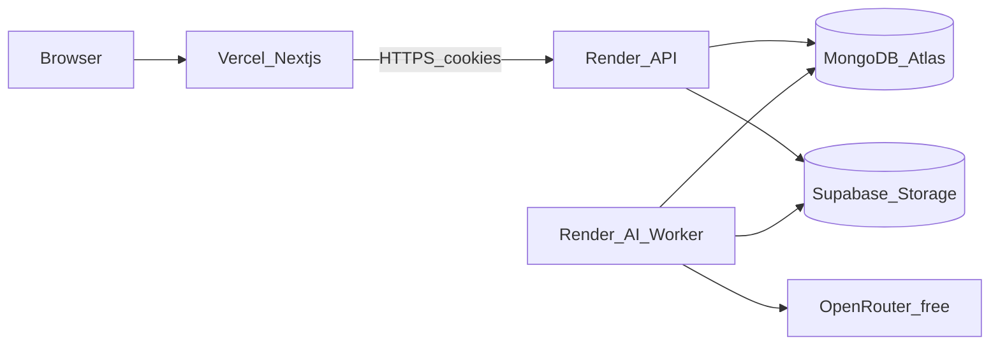

# CloudVault Production Deployment Guide

This document details production deployment for **Render (API + AI worker) + Vercel (frontend)**, plus local runbooks and optimization notes.

---

## 1. System Architecture



CloudVault processes:
- **API** (Express): auth, workspaces, files, search, AI job enqueue
- **AI worker**: polls `AIJob`, extracts text, calls OpenRouter, writes `AIResult`
- **Frontend** (Next.js): dashboard UI on Vercel

---

## 2. Environment Variables

### Backend / Worker (Render)

| Variable | Required | Notes |
| :--- | :--- | :--- |
| `NODE_ENV` | Yes | `production` |
| `PORT` | Yes | Render sets this; default `3000` |
| `MONGO_URI` | Yes | Atlas connection string |
| `JWT_SECRET` | Yes | >= 32 random chars |
| `SUPABASE_URL` | Yes (prod) | Project URL |
| `SUPABASE_SERVICE_ROLE_KEY` | Yes (prod) | Server only |
| `SUPABASE_BUCKET` | No | Default `cloudvault-files` |
| `STORAGE_USE_MOCK` | No | Must be `false` in prod |
| `CORS_ORIGINS` | Yes (prod) | Exact Vercel origin(s), comma-separated |
| `COOKIE_CROSS_SITE` | Yes (prod) | `true` for Vercel↔Render cookies |
| `AI_PROVIDER` | No | `openrouter` or `mock` |
| `OPENROUTER_API_KEY` | If openrouter | Secret |
| `OPENROUTER_MODEL` | No | Default `openrouter/free` |
| `OPENROUTER_EMBEDDING_MODEL` | No | Default `local` |
| `LOG_LEVEL` | No | `info` |

Blueprint: [`render.yaml`](render.yaml). Fill `sync: false` secrets in the Render dashboard.

### Frontend (Vercel)

| Variable | Required | Example |
| :--- | :--- | :--- |
| `NEXT_PUBLIC_API_URL` | Yes | `https://cloudvault-api.onrender.com` |

Template: [`frontend/.env.example`](frontend/.env.example).

---

## 3. Deploy runbook (Render + Vercel)

### A. Prerequisites

1. MongoDB Atlas cluster + network access for Render IPs (or `0.0.0.0/0` for free tier)
2. Supabase project + `cloudvault-files` bucket
3. OpenRouter key (optional but recommended)
4. GitHub repo connected to Render and Vercel

### B. Render — API + worker

1. Dashboard → **New** → **Blueprint** → select this repo (`render.yaml`)
2. Create services `cloudvault-api` and `cloudvault-ai-worker`
3. Set secrets: `MONGO_URI`, `JWT_SECRET`, `SUPABASE_*`, `OPENROUTER_API_KEY`, `CORS_ORIGINS`
4. Deploy API first; note the public URL (e.g. `https://cloudvault-api.onrender.com`)
5. Confirm `GET /health` returns `200` with `"database":"up"`

### C. Vercel — frontend

1. Import repo → **Root Directory** = `frontend`
2. Framework: Next.js
3. Env: `NEXT_PUBLIC_API_URL=<Render API URL>` (no trailing slash)
4. Deploy; note the Vercel URL

### D. Wire CORS + cookies

1. On Render API (and optionally worker is N/A): set  
   `CORS_ORIGINS=https://your-app.vercel.app`  
   (include preview URLs if needed, comma-separated)
2. Keep `COOKIE_CROSS_SITE=true` so auth uses `SameSite=None; Secure`
3. Redeploy API after env change
4. Hard-refresh the Vercel site → register/login → upload → enable AI → reprocess

### E. Verify production

- [ ] `GET /health` → 200
- [ ] Login sets cookie; `/auth/me` works from the Vercel origin
- [ ] Upload + download file (Supabase)
- [ ] AI worker completes job (`READY`, non-mock model when OpenRouter configured)
- [ ] Mentions / notifications still work

---

## 4. Local development

```bash
# Terminal 1 — API
npm run dev

# Terminal 2 — AI worker
npm run worker:dev

# Terminal 3 — Frontend
cd frontend && npx next dev -p 3001
```

Local CORS defaults to `http://localhost:3001`. Keep `COOKIE_CROSS_SITE=false` locally.

---

## 5. Health check

### `GET /health`

- **200** when MongoDB is connected (`status: "ok"`, `services.database: "up"`)
- **503** when MongoDB is down (`status: "degraded"`, `services.database: "down"`)

Used by Render `healthCheckPath`.

---

## 6. Security notes

See [SECURITY.md](SECURITY.md).

- Production JSON logging (no `pino-pretty`)
- Weak `JWT_SECRET` rejected in production
- Auth cookie: `httpOnly`; cross-site deployments use `SameSite=None; Secure`
- `trust proxy` enabled for Render TLS termination
- Never put `SUPABASE_SERVICE_ROLE_KEY` or `OPENROUTER_API_KEY` in `NEXT_PUBLIC_*`

---

## 7. Optimization (short pass already in repo)

- Compound indexes for active file lists and notification feeds
- Worker remains a separate process (do not fold into API web dyno)
- Prefer free OpenRouter models + `OPENROUTER_EMBEDDING_MODEL=local` to control cost
- CI: [`.github/workflows/ci.yml`](.github/workflows/ci.yml) builds backend/frontend and runs fast unit tests

### Follow-ups (later)

- Paid Render plans if free-tier spin-down is unacceptable
- Stronger embeddings (paid model) when semantic search quality matters
- CDN / signed URL caching for large downloads
- Observability (structured error tracking)

---

## 8. Process commands

| Process | Build | Start |
| :--- | :--- | :--- |
| API | `npm ci && npm run build` | `npm start` |
| Worker | `npm ci && npm run build` | `npm run worker` |
| Frontend | `cd frontend && npm ci && npm run build` | `npm start` (Vercel handles) |
