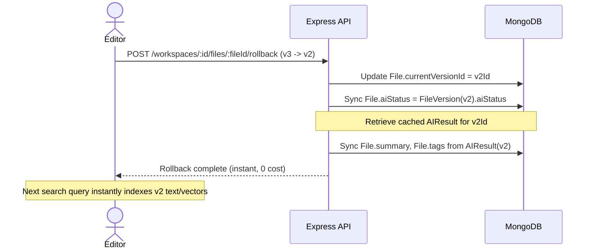

# Design Review – Phase 10: Search Architecture & Contract Freeze

This document defines the architectural boundaries, search constraints, data models, visibility rules, and indexing strategy for the CloudVault search layer before any code implementation begins.

---

## Section 1 – Search Source Of Truth

We evaluate the source of truth for the search index:

| Option | Description | Advantages | Disadvantages | Migration Cost | UX Implications | Scalability Implications |
| :--- | :--- | :--- | :--- | :--- | :--- | :--- |
| **Option A** | Operate search on the `File` model only. | Extremely simple queries; fits flat list views naturally. | Cannot access version-specific summaries, tags, or full-text content. | None. | Poor. Users cannot search content or AI insights. | High. Limited to simple name queries. |
| **Option B (Recommended)** | **Operate search on the active `FileVersion` and `AIResult`.** | Reflects the current state of the document; matches the active pointer; prevents duplicate search results for the same file. | Requires joint lookup/aggregation between `File` and `AIResult`. | Minimal (pointers are already maintained). | Excellent. Results represent the active version's actual content. | **Outstanding.** Index size is capped at exactly $N$ active files. |
| **Option C** | Operate search across all historical `FileVersion` records. | Allows users to find keywords in older historical drafts. | Bloated search results with duplicate files; large index size. | High (requires complex UI grouping). | Confusing. Shows same file multiple times. | Poor. Index size grows linearly with history size. |

### Justification
**Option B (Active FileVersion)** is chosen. It enforces clean data integrity: search should represent the current, active state of the user's workspace. By matching search against `File.currentVersionId` linked to `AIResult.fileVersionId`, we query only the active revision, preventing version ambiguity and search results pollution.

---

## Section 2 – Architectural Review & Rollback Behavior

### Rollback Scenario Flow


### Rationale & Justification
When rolling back from `v3` to `v2`, the system must **instantly use the cached v2 summary, tags, and embeddings**.
* **Zero Reprocessing Overhead**: Because the physical text of `v2` was already processed during its initial upload, its summary, tags, and vector embeddings are permanently stored in the `AIResult` document corresponding to `v2`'s `FileVersion`.
* **Sub-millisecond Swaps**: The rollback operation only updates the logical `File` pointer and cached fields. No LLM or embedding APIs are called, ensuring 0% latency overhead and $0 cost.

---

## Section 3 – Search Visibility Rules

### Version Visibility
* **Rule**: Only the **current active version** is searchable.
* **Justification**: Searching historical files introduces clutter and duplicates in search result lists. Historical search remains an premium feature out of scope for Phase 10.

### Deleted Files Visibility
* **Soft Deleted Files**: Files marked as `status = 'DELETED'` or `deletedAt !== null` **must be excluded** from search results.
  * *Justification*: Users expect the search bar to show active workspace files. Trash items must stay in the trash view.
* **Hard Deleted Files**: Physically deleted from MongoDB and Supabase; naturally excluded.
* **Deleted AIResults / Jobs**: Cascade-deleted on file hard-delete; naturally excluded.

---

## Section 4 – AI-Disabled Workspaces

We compare the search behavior when `workspace.aiEnabled = false`:

* **AI-Disabled Workspace (Allowed: Filename + Basic Metadata Search)**
  * *Rationale*: If AI is disabled, the system has no summaries or embeddings. However, users still expect to search by filename, extension, size, and creation date. Disabling search entirely degrades the user experience.
* **AI-Enabled Workspace (Allowed: Filename + Metadata + Content + Semantic Search)**
  * *Rationale*: Full search capabilities are unlocked. Keyword queries scan filenames, summaries, and full-text caches, while concept queries utilize vector cosine similarities.

---

## Section 5 – Search Ranking Strategy

Keyword search relevance will be determined by a weighted hierarchy of signals:

```text
Filename (Weight: 1.0)
   ↳ Tags (Weight: 0.8)
       ↳ Summary (Weight: 0.5)
           ↳ Extracted Text (Weight: 0.2)
```

1. **Filename (Highest Importance)**: Exact or prefix name matches represent direct user target intention (e.g. typing "Resume" matches `Resume.pdf` first).
2. **Tags**: Highly concentrated tokens (AI-generated or user-defined) carrying strong conceptual focus.
3. **Summary**: The core distilled context of the file. Matches here indicate strong relevance to the document's main subjects.
4. **Extracted Text (Lowest Importance)**: Matches on raw content can find niche details but have a high rate of false positives (noise), thus carrying lower search weight.

---

## Section 6 – Search Data Model Review

### Recommended: Option A (Direct Search from File + AIResult)
Instead of introducing a duplicate `SearchDocument` collection (Option B), the search query will execute directly against the `File` and `AIResult` collections using MongoDB `$lookup` or two-step querying.

```mermaid
flowchart TD
    Query[Search Query] --> FileColl[File Collection]
    Query --> AIResultColl[AIResult Collection]
    FileColl -- Match status = ACTIVE -->> Join[Lookup / Join]
    AIResultColl -- Match activeVersionId -->> Join
    Join --> Result[Combined Results]
```

### Rationale
* **Zero Synchronization Debt**: We do not duplicate titles, tags, or summaries. If a file is renamed, deleted, or rolled back, the changes are instantly reflected in the search index with zero background sync latency.
* **Low Code Complexity**: Avoids writing complex synchronization triggers that handle file edits, version uploads, soft deletes, and hard deletes.

---

## Section 7 – Semantic Search Readiness (Phase 11 Compatibility)

The current `AIResult` schema is **fully ready** for Phase 11 (Semantic Search).

```typescript
export interface IAIResult extends Document {
  embedding: number[];              // Float array (e.g. 1536 dims)
  embeddingModel: string;           // e.g. "text-embedding-3-small"
  embeddingDimensions: number;      // e.g. 1536
  embeddingVersion: number;         // Schema versioning
}
```

### Migration & Upgrade Strategy
* **Gaps**: No vector index is registered on MongoDB yet.
* **Risks**: Upgrading the embedding model (e.g. from OpenAI `v1` to `v2`) makes older embeddings incompatible.
* **Mitigation**: The `embeddingVersion` and `embeddingModel` fields act as schema guards. During search, we filter for active model versions. If an upgrade occurs, a background migration queues low-priority reprocessing jobs (as defined in `PHASE_8_SPECIFICATION` Section 18).

---

## Section 8 – Search API Contract

```http
GET /workspaces/:workspaceId/search
```

### Query Parameters
* `q` (string, required): The search term.
* `page` (number, optional): Current page (default: `1`).
* `limit` (number, optional): Items per page (default: `20`, max: `100`).
* `type` (string, optional): Search mode. Enum: `KEYWORD` | `SEMANTIC` | `ALL` (default: `ALL`).

### Response Contract (`200 OK`)
```json
{
  "items": [
    {
      "fileId": "6a293b87f172d4ebf5ddb7d9",
      "name": "project_timeline.pdf",
      "mimeType": "application/pdf",
      "aiStatus": "READY",
      "summary": "AI generated summary of the project timeline.",
      "tags": ["timeline", "project", "milestones"],
      "updatedAt": "2026-06-10T10:00:00.000Z",
      "matchedOn": "name" | "tag" | "summary" | "text" | "semantic",
      "score": 0.95
    }
  ],
  "page": 1,
  "limit": 20,
  "total": 1
}
```

### Error Contracts
* `400 Bad Request`: If query parameter `q` is missing or empty.
* `403 Forbidden`: If user is not authorized or is not a viewer in the workspace.
* `404 Not Found`: If the target workspace does not exist or has been deleted.

---

## Section 9 – Scalability Review

* **10,000 files**: Sub-millisecond keyword search latency using compound indexes `{ workspaceId: 1, status: 1 }` and text indexes on `name`, `tags`, and `summary`.
* **100,000 files**: Text file storage in Supabase keeps MongoDB document sizes extremely small, preventing RAM eviction of indexes.
* **1,000,000 files**:
  * **Memory footprint**: 1.5M embeddings (1536 float dimensions) occupy $\approx 6.14$ GB. We must allocate a dedicated Atlas Vector tier.
  * **Vector indexing**: Native MongoDB Atlas Vector Search handles cosine similarity metrics efficiently using hierarchical navigable small world (HNSW) graphs.

---

## Section 10 – Technical Debt Register

We register the following items to prevent architectural degradation:

| ID | Title | Impact | Priority | Target Phase | Status |
|----|-------|--------|----------|--------------|--------|
| **TD-056** | Vector Index Memory Allocation | Performance drops if vector indexes exceed Atlas instance RAM | Medium | Phase 11 | Pending |
| **TD-057** | Cross-Workspace Search Leakage | Critical security breach if search scopes aren't isolated | Critical | Phase 10 | Pending |
| **TD-058** | Embedding Model Migration path | Obsolete embeddings on model upgrades | Low | Phase 11 | Pending |

---

## Section 11 – Senior Engineering Review

### Architectural Observations
* **Monolithic Simplicity**: By running text searches and vector searches natively inside MongoDB (Atlas Vector Search), we keep our stack lightweight and avoid the complexity of synchronization daemons for external index systems (Elasticsearch, Pinecone, Redis).
* **Reference Isolation**: Search logic is fully decoupled from the async worker queues. It reads purely from structured results in `File` and `AIResult`.

### Future Risks
* **Text Indexing Limits**: MongoDB's standard text indexes have limited support for multi-language tokenization and fuzzy matching compared to dedicated engines like Elasticsearch.
  * *Mitigation*: Leverage Atlas Search (Lucene-based) if fuzzy search requirements become advanced.

### Open Questions
* *Fuzzy matching tolerance*: How strict should the keyword match scoring be? (Default MongoDB search uses standard stemming).
