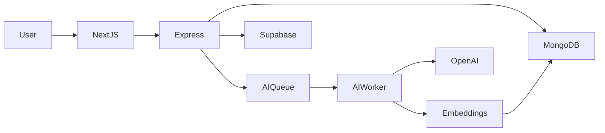

# ☁️ CloudVault

AI-Powered Collaborative Document Workspace

<div align="center">

[](https://www.typescriptlang.org/)
[](https://nodejs.org/)
[](https://expressjs.com/)
[](https://www.mongodb.com/)
[](https://react.dev/)
[](https://nextjs.org/)
[](https://supabase.com/)
[](https://tailwindcss.com/)
[](LICENSE)

</div>

---

## 🎯 Product Vision

> Storage is infrastructure. Document intelligence is the product.

In the modern digital landscape, storing files is a solved problem. The real challenge is extracting meaningful value, contextual intelligence, and enabling collaboration on top of those files. 

CloudVault is built to address this challenge. It provides a secure document storage foundation and layers it with workspace-focused collaborative utilities, preparing to inject automated document intelligence workflows (auto-summarization, classification, semantic search).

### Target Audiences
* **Students**: Structure course work, collaborate on project folders, and automatically summarize research materials.
* **Startup Teams**: Maintain a single source of truth for business documents, coordinate revisions, and chat directly in context.
* **Placement Groups**: Aggregate resumes, prepare guidelines, and notify members of review feedback.
* **Research Teams**: Track version histories of papers, comment on specific dataset drafts, and leverage semantic search across libraries.

---

## 📊 Architecture Overview

CloudVault splits data storage cleanly between MongoDB (metadata) and Supabase (binaries), processing heavy tasks through an asynchronous job queue.



---

## ✨ Features

### Authentication & Authorization
* **Secure JWT**: Signed JSON Web Tokens stored in HTTP-only cookies to eliminate local storage token vulnerabilities.
* **HttpOnly Session Security**: Session token exchange handled purely over HTTP-only headers.
* **Session Validation & State Guarding**: Route-level frontend guards verify initialized session states before allowing navigation.

### Workspace System
* **Personal Workspaces**: Private workspace created automatically upon registration for solo file storage.
* **Team Workspaces**: Shareable environments that allow owners to invite members with roles.
* **Role-Based Access Control (RBAC)**: Fine-grained permission levels (`OWNER`, `ADMIN`, `EDITOR`, `VIEWER`) enforced via Express middleware.

### Storage Integration
* **Secure Uploads**: Enforces limits on upload sizes (100MB max) and file types (e.g. PDF, Office, text, images).
* **Signed URLs**: Generates temporary, single-use download links with a 60-second expiry directly from Supabase Storage.
* **Versioning Architecture**: Preserves file history by maintaining a physical `FileVersion` record separate from the logical `File` metadata.

### Document Collaboration
* **Comments Feed**: Contextual, document-focused thread lists.
* **Mentions**: `@username` highlights and user-resolution system within comments.
* **Notifications**: Integrated notification feed informing users of comments, mentions, invitations, and role updates.
* **Activity Audit Trail**: Lightweight, immutable log capturing all workspace actions for audit and transparency.

### Security & Isolation
* **Workspace Isolation**: Multi-tenant database boundary verification on every resource request.
* **Private Buckets**: All binary objects stored in private, access-restricted Supabase storage containers.
* **Permission Enforcement**: Backend middleware validation prevents data leakage or unauthorized access.

---

## 🗄️ Database Design & Relationships

CloudVault uses MongoDB to manage fast-moving collaborative metadata. The database model consists of the following collections:

```text
  ┌──────────┐            ┌─────────────┐            ┌─────────────────┐
  │   User   │───────────▶│  Workspace  │◀───────────│ WorkspaceMember │
  └──────────┘            └─────────────┘            └─────────────────┘
        │                        │                            │
        │                        ▼                            │
        │                 ┌─────────────┐                     │
        │                 │    File     │◀────────────────────┘
        │                 └─────────────┘
        │                        │
        │                        ▼
        │                 ┌─────────────┐
        │                 │ FileVersion │
        │                 └─────────────┘
        │                        │
        ▼                        ▼
  ┌──────────┐            ┌─────────────┐            ┌─────────────────┐
  │ Comment  │◀───────────│Notification │◀───────────│   ActivityLog   │
  └──────────┘            └─────────────┘            └─────────────────┘
```

* **User**: Stores email, username (lowercased), name, password hash, and avatar.
* **Workspace**: Represents a container (Personal or Team). Linked to `User` (ownerId).
* **WorkspaceMember**: Connects a `User` to a `Workspace` with a specific role (`OWNER`/`ADMIN`/`EDITOR`/`VIEWER`).
* **Folder**: Represents structural hierarchy inside a workspace.
* **File**: Stores logical metadata for a document (active version number, tags, summarization cache).
* **FileVersion**: Stores the physical binary metadata (Supabase storage key, size, uploader) for a specific revision of a `File`.
* **Comment**: Comments made on a `File`. Links to the author `User` and references mentioned `User` records in the `mentions` array.
* **Notification**: Delivers activity reports to a user's inbox. Links to `User` (recipient) and payload containing target resources.
* **ActivityLog**: Immutable record of a specific user action (e.g. `FILE_UPLOADED`). Linked to `Workspace` and `User` (actor).

---

## 📈 Scalability Considerations

### Metadata-Only Strategy
MongoDB is never used to store files. It stores queries, tags, summaries, and structural records. Physical files reside in Supabase Storage, scaling to millions of documents without bloating the core database backups.

### File Version Architecture
Each file upload represents a logical record containing version pointers. Repeated edits update version links, avoiding redundant object definitions and enabling instant rolling changes without moving physical blocks.

### Activity Feed Strategy
Activity audits scale continuously. The backend utilizes compound indexing on `{ workspaceId: 1, timestamp: -1 }` with strict server-side cursor pagination to ensure fast querying regardless of historical log sizes.

### Notification Strategy
User notifications use compound indexes `{ userId: 1, isRead: 1, createdAt: -1 }` to instantly deliver unread lists without scanning table tables, capping query execution times to sub-millisecond ranges.

### AI Processing Ready
The metadata schemas include placeholders for automated analysis outcomes (summaries, text extractions, vector indices). Jobs are queued asynchronously to prevent OpenAI/embeddings latency from blocking core upload routes.

---

## Roadmap

```text
✅ Phase 0   - Architecture Freeze
✅ Phase 1   - Backend Foundation
✅ Phase 2   - Database Layer
✅ Phase 3   - Authentication & Authorization
✅ Phase 4   - Frontend Foundation
✅ Phase 5   - Workspace System
✅ Phase 6   - Storage Integration
✅ Phase 6.5 - Activity System
✅ Phase 7   - Collaboration Layer (Comments, Mentions, Notifications)
⬜ Phase 8   - AI Infrastructure (Worker queues & async jobs)
⬜ Phase 9   - AI Features (Auto-summaries & classification)
⬜ Phase 10  - Basic Search
⬜ Phase 11  - Semantic Search
⬜ Phase 12  - UI/UX Refinement
⬜ Phase 13  - Testing & QA
⬜ Phase 14  - Production Deployment
```

---

## 🚀 Getting Started

### Prerequisites
* Node.js 20+
* MongoDB 6.0+
* Supabase project with storage bucket

### Installation & Run

1. **Clone & Install**
   ```bash
   git clone https://github.com/Strarist/CloudVault.git
   cd CloudVault
   npm install
   cd frontend && npm install && cd ..
   ```

2. **Configure Environment**
   Create a `.env` in the root directory:
   ```env
   PORT = 3000
   MONGO_URI = mongodb://0.0.0.0/cloudVault-drive
   JWT_SECRET = your_secret_here
   SUPABASE_URL = your_supabase_url
   SUPABASE_SERVICE_ROLE_KEY = your_service_role_key
   SUPABASE_BUCKET = cloudvault-files
   ```

3. **Compile & Boot**
   ```bash
   # Run Dev Backend & Frontend
   npm run dev
   # (In another terminal)
   cd frontend && npm run dev
   ```

---

## 🧪 Testing

```bash
# Run Collaboration API Tests
npm run test:collaboration

# Run Stability & Bug Regression Tests
npm run test:stability
```

---

## 🔒 Open Technical Debt Register

| ID | Title | Impact | Priority | Target Phase | Status |
|----|-------|--------|----------|--------------|--------|
| **TD-023** | File Deletion Lifecycle Policy | Orphaned versions clean-up | High | Phase 9 | Pending |
| **TD-034** | Duplicate Logout Investigation | Frontend page redirect recursion | High | Post-deploy | Verified |
| **TD-025** | Delete Rollback Behavior | Restoration of soft deleted files | Medium | Phase 12 | Pending |
| **TD-030** | Cursor Pagination Migration | Large data-set loading | Medium | Phase 11+ | Pending |
| **TD-031** | Activity Retention Policy | Long-term storage growth | Medium | Phase 13 | Pending |
| **TD-035** | Notification Compound Index | Scale queries: `{ userId: 1, isRead: 1, createdAt: -1 }` | Medium | Phase 8 | Pending |
| **TD-036** | Mention Parsing Hardening | Regex support for usernames with symbols (`-`, `_`, `.`) | Low | Phase 8 | Pending |
| **TD-037** | Notification Fan-Out Scaling | Batch queue processing for large-workspace notifications | Low | Phase 9 | Pending |
| **TD-038** | Extracted Text Storage Consistency | Orphaned extracted text files cleanup in Supabase | Medium | Phase 9 | Pending |
| **TD-039** | AI Model Version Tracking | Decouple summaries and vector versions | Low | Phase 8 | Pending |
| **TD-040** | Embedding Migration Strategy | Batch reprocessing script for vector models upgrade | Low | Phase 11 | Pending |
| **TD-041** | Worker Runtime Separation | Production infrastructure scaling configuration | Medium | Phase 8 | Pending |
| **TD-042** | AI Cost Governance | Monthly workspace limits and throttling enforcement | High | Phase 8 | Pending |
| **TD-043** | AIResult Schema Versioning | Schema upgrade script for summaries/embeddings | Low | Phase 8 | Pending |
| **TD-044** | Queue Starvation Protection | Priority-based job extraction worker logic | Medium | Phase 8 | Pending |
| **TD-045** | Provider Abstraction Layer | Extracted text provider interface implementation | Low | Phase 8 | Pending |
| **TD-046** | Graceful Worker Shutdown | Handle SIGTERM/SIGINT signal terminations cleanly | Low | Phase 8 | Pending |
| **TD-047** | Provider Error Classification | Transient vs Permanent API error sorting | Low | Phase 8 | Pending |
| **TD-048** | AI Result Atomic Writes | Aggregate results in memory before single write | Low | Phase 8 | Pending |
| **TD-049** | AI Worker Metrics Dashboard | Queue depth, failure logging, and time stats views | Low | Phase 8 | Pending |
| **TD-050** | AIResult future multi-result support | Support fileVersionId + resultType compound keys | Low | Phase 9 | Pending |
| **TD-051** | Heartbeat hang detection | Alert on process frozen but not terminated | Low | Phase 9 | Pending |
| **TD-052** | Delete cascade centralization | Refactor to centralized FileCleanupService | Low | Phase 9 | Pending |
| **TD-053** | File & Version Status Alignment | Inconsistent defaults between File and FileVersion on upload | High | Phase 9.25 | Resolved |
| **TD-056** | Vector Index Memory Allocation | Performance drops if vector indexes exceed Atlas instance RAM | Medium | Phase 11 | Pending |
| **TD-057** | Cross-Workspace Search Leakage | Critical security breach if search scopes aren't isolated | Critical | Phase 10 | Pending |
| **TD-058** | Embedding Model Migration path | Obsolete embeddings on model upgrades | Low | Phase 11 | Pending |


